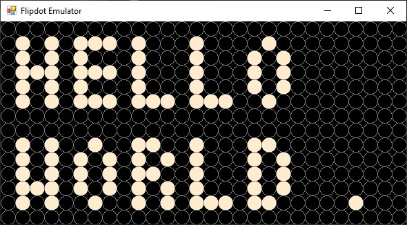
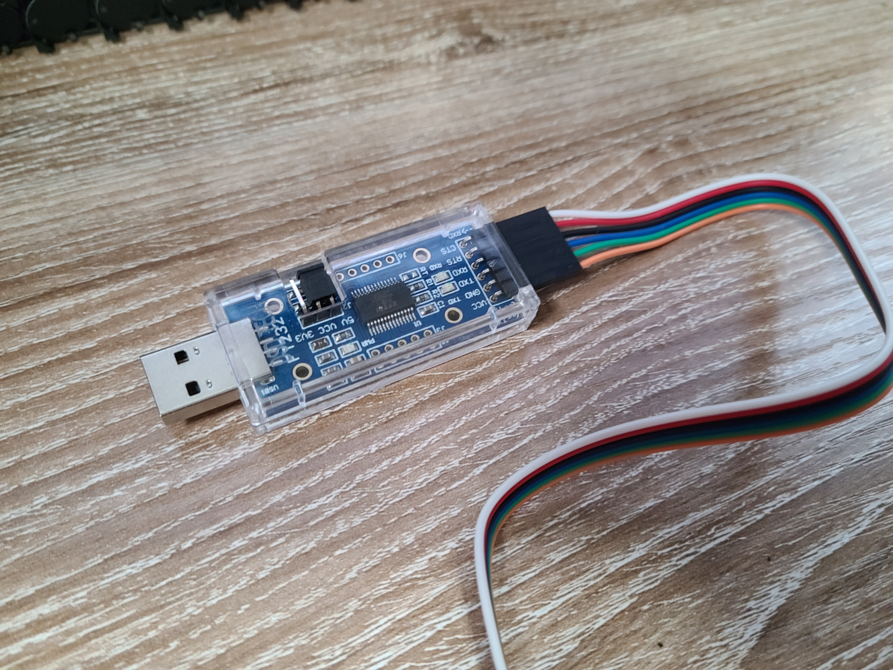
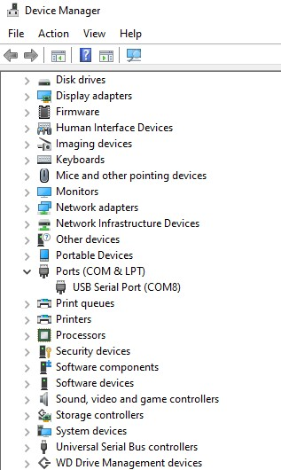

# AlphaZeta Flip-Dot emulator

## Description

This project offers an emulator for the 28x14 magnetic flip dots panel called [Flip-Dot Boards XY5](https://flipdots.com/en/products-services/flip-dot-boards-xy5/) [AlfaZeta](https://flipdots.com/en/home/).

The panel is controlled via a wire protocol over RS485. This emulator will behave exactly like the actual physical display using a serial port on the local machine.



## Requirements

### Software

This emulator is a .Net Windows application and hence requires running Windows and having the [.NET Framework 4.6.1](https://www.microsoft.com/en-US/download/details.aspx?id=48130) or above installed.
If you want to inspect or modify the code, you will need [Visual Studio 2019](https://visualstudio.microsoft.com/downloads/) for Windows installed with support for C#.

### Hardware

Besides the Windows PC to run the emulator application, you will need the following:

- **A device to control the display**. that has a display driver and application to control the Flip-Dot panel. You can find and example of an Azure Sphere MT3620 development kit controlling the panel in [this repository](https://github.com/olivierbloch/Azure-RTOS-GUIX-Flip-Dot-Display-Driver).
- **A serial to USB adapter**. With the actual physical display you would need to connect the device controlling the display using a serial cable or adapter. To connect your device to the emulator running on your PC you will need an adapter. We recommend using one that uses an FTDI chip as these are way less problematic if you are running Windows 10 on your development machine. Here is a [good one from DSD Tech](https://www.amazon.com/gp/product/B07BBPX8B8/ref=ppx_yo_dt_b_asin_title_o00_s00?ie=UTF8&psc=1) which works perfectly and costs less than $10:



## Instructions

### Connecting the device to your PC

The first step to use the emulator is to connect your device to the PC using the serial to USB adapter mentioned in the Hardware requirements section above.

1. Follow the instructions of the adapter manufacturer to install the drivers. We'll assume that you have the drivers installed (whether through a stand alone install or through Windows update) and that a new Serial Port is available in Windows when you connect the adapter.
1. Connect your device's serial port GND and TXD pins to the GND and RXD pins of the adapter.
1. Connect your adapter to your PC
1. Identify which serial port # has been assigned to your adapter opening the Windows Device Manager right-clicking on the windows icon and selecting Device Manager in the pop up menu and take note of the COM port number



### Run the emulator

#### Option #1: Download and run the binary application

1. Download the binary from the releases section (coming soon)
1. Run the application
1. Select the COM port for your adapter (see previous section)

#### Option #2: Clone and compile the application

1. Clone the project using the following command:

```bash
git clone https://github.com/mikehall-ms/FlipDotEmluator.git
```

2. Open the solution from the repository in Visual Studio
1. Hit F5 to compile and run
1. Select the COM port for your adapter (see previous section)
